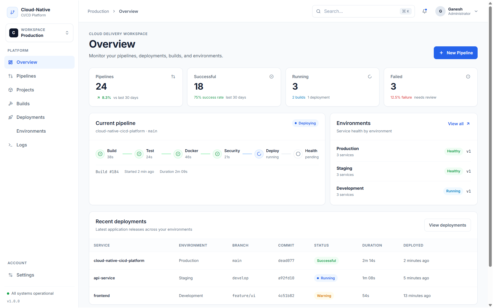
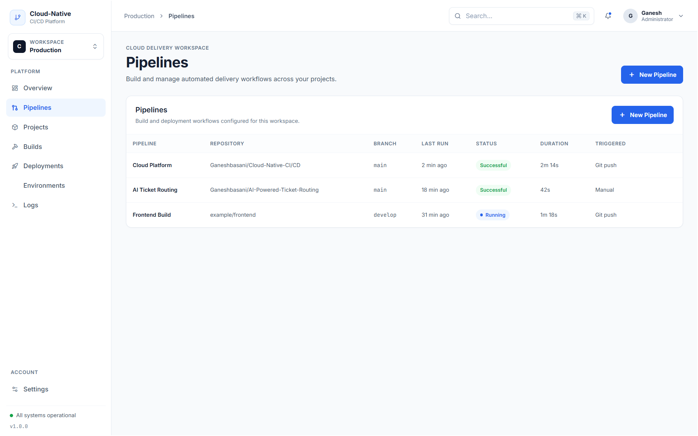
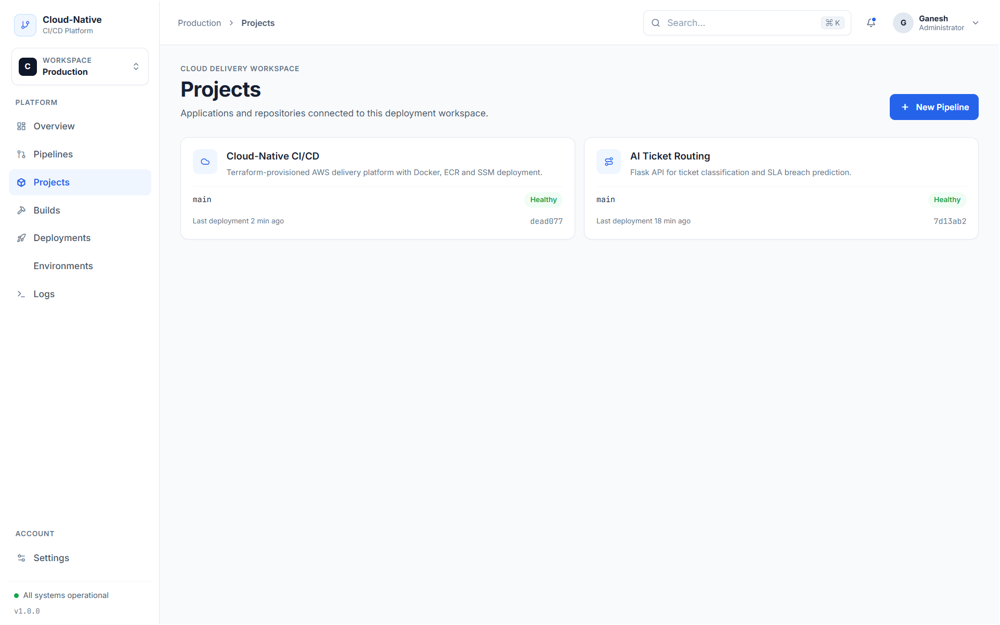
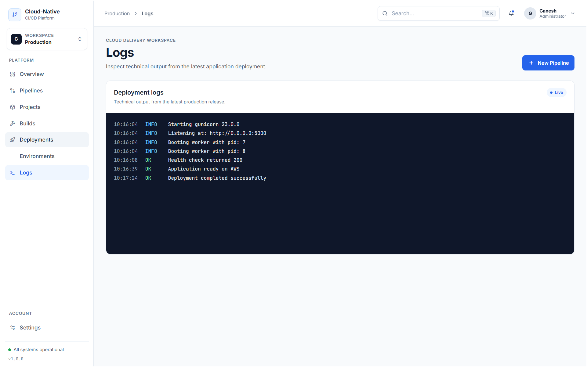
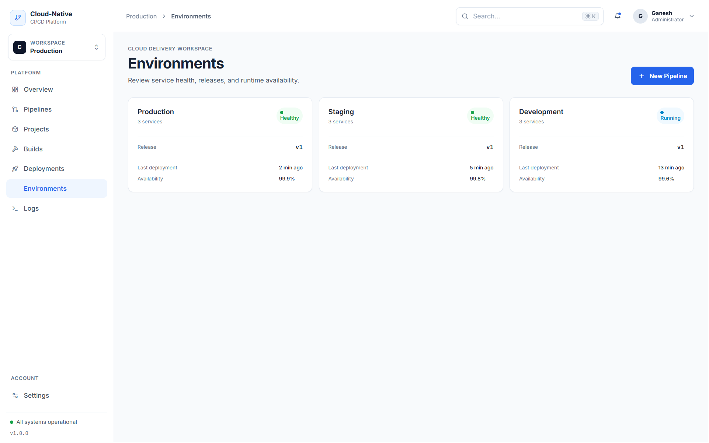
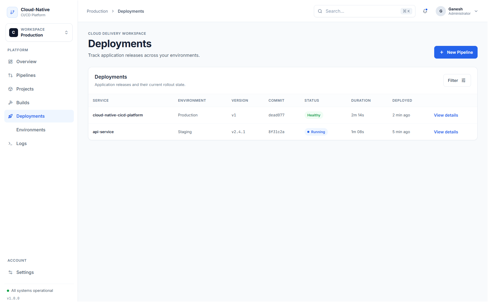
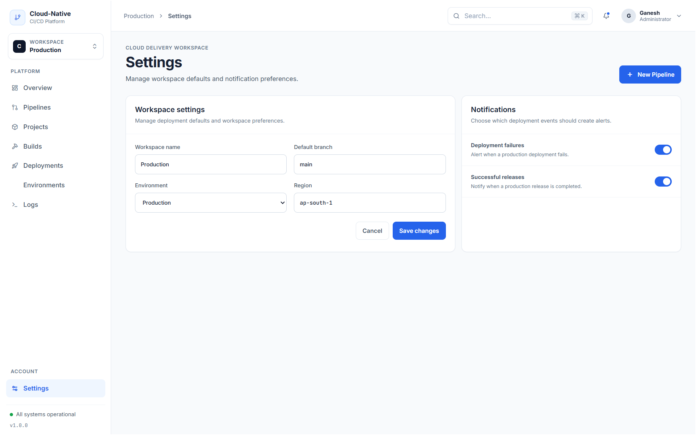
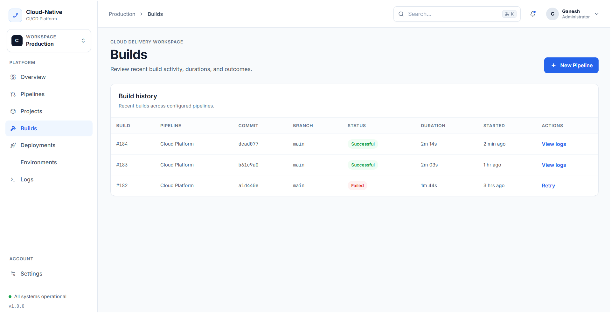
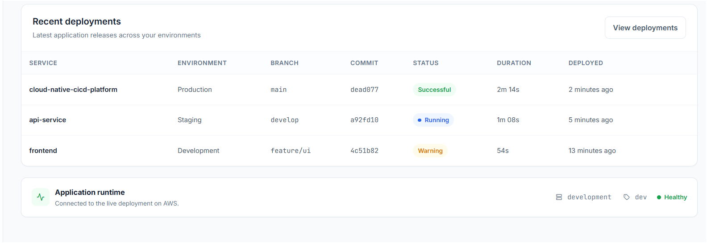

# Cloud-Native CI/CD Deployment Platform

A production-oriented CI/CD and cloud deployment platform for containerized applications.

The platform demonstrates an end-to-end software delivery workflow covering application testing, Docker containerization, vulnerability scanning, Amazon ECR image publishing, infrastructure provisioning with Terraform, and deployment to AWS EC2 through AWS Systems Manager.

## Live Demo

**Application:** https://cloud-native-cicd-deployment-platform.onrender.com/

The live application provides a professional deployment dashboard with application health, environment, version, pipeline, deployment, build, and runtime information.

---

## Overview

The **Cloud-Native CI/CD Deployment Platform** is designed to make application delivery more repeatable and less dependent on manual server operations.

Instead of manually building an application, creating a container, scanning it, pushing it to a registry, connecting to a server, starting the container, and checking whether the deployment works, the project brings these activities into a structured delivery workflow.

### Delivery Flow

```text
Developer
    |
    v
GitHub
    |
    v
Jenkins
    |
    +---- Automated Tests
    |
    +---- Docker Build
    |
    +---- Trivy Security Scan
    |
    v
Amazon ECR
    |
    v
AWS Systems Manager
    |
    v
Amazon EC2
    |
    v
Docker + Gunicorn
    |
    v
Flask Application
    |
    v
Health Check
```

---

## Key Features

- Professional light enterprise-style deployment dashboard
- Python Flask backend
- REST-style application endpoints
- Docker containerization
- Gunicorn production application server
- Automated Pytest test suite
- Trivy container image security scanning
- Amazon Elastic Container Registry (ECR)
- Amazon EC2 deployment
- AWS Systems Manager based remote deployment
- Terraform infrastructure as code
- IAM role based EC2 access
- Docker health checks
- Application version and environment reporting
- Responsive dashboard UI
- Runtime status and deployment information
- Technical deployment/log presentation

---

## Technology Stack

### Application

- Python
- Flask
- Gunicorn
- HTML
- CSS
- JavaScript
- Inter
- JetBrains Mono

### DevOps

- Git
- GitHub
- Jenkins
- Docker
- Trivy

### AWS

- Amazon EC2
- Amazon ECR
- AWS Systems Manager
- AWS IAM
- AWS CLI

### Infrastructure

- Terraform
- Ubuntu Linux

### Testing

- Pytest

---

## Architecture

```text
                         Internet
                            |
                            v
                 Cloud-Native CI/CD UI
                            |
                            v
                     Flask Application
                            |
                            v
                       Gunicorn
                            |
                    +-------+-------+
                    |               |
                    v               v
                 /health        /api/status
                    |
                    v
               Docker Container
                    |
                    v
                AWS EC2

CI/CD:

GitHub
   |
   v
Jenkins
   |
   +--> Pytest
   |
   +--> Docker Build
   |
   +--> Trivy Scan
   |
   v
Amazon ECR
   |
   v
AWS Systems Manager
   |
   v
Amazon EC2
```

---

## Application Dashboard

The application includes a professional SaaS-style deployment interface designed for engineering and DevOps workflows.

It follows a restrained enterprise design system:

- Light interface
- White surfaces
- Soft gray application background
- Blue primary actions
- Neutral typography
- Compact information-dense cards
- Professional status badges
- Subtle borders
- Minimal shadows
- Responsive layout
- Dark terminal surface only for technical logs

---

## Screenshots

### Dashboard



### Pipelines



### Projects



### Builds



### Deployments



### Environments



### Logs



### Live Application



### Settings



---

## CI/CD Workflow

The project is structured around a standard container delivery workflow.

### 1. Source

Application code is maintained in GitHub.

```text
git push
```

triggers the software delivery process.

### 2. Automated Testing

Pytest validates the Flask application before a container is released.

```bash
python -m pytest tests -v
```

### 3. Docker Build

The application is packaged into a Docker image.

```bash
docker build -f docker/Dockerfile -t cloud-native-cicd-platform .
```

### 4. Security Scanning

Trivy scans the built Docker image for high and critical vulnerabilities.

### 5. Container Registry

The validated image is published to Amazon ECR.

```text
Amazon ECR
cloud-native-cicd-platform
```

### 6. Deployment

AWS Systems Manager sends deployment commands to the EC2 instance.

The EC2 instance pulls the image from ECR and starts the container.

### 7. Health Verification

The deployment is validated through the application health endpoint.

```text
GET /health
```

---

## Application Endpoints

| Method | Endpoint | Purpose |
|---|---|---|
| GET | `/` | Dashboard UI |
| GET | `/api/status` | Application status information |
| GET | `/health` | Health check |
| GET | `/ready` | Readiness check |
| GET | `/version` | Application version and environment |

### Health Response

```json
{
  "status": "healthy",
  "version": "v1"
}
```

### Status Response

```json
{
  "service": "cloud-native-cicd-platform",
  "status": "running",
  "version": "v1",
  "environment": "aws"
}
```

---

## Project Structure

```text
Cloud-Native-CICD-Deployment-Platform/
|
+-- app/
|   +-- app.py
|   +-- requirements.txt
|   |
|   +-- templates/
|   |   +-- index.html
|   |
|   +-- static/
|       +-- styles.css
|       +-- app.js
|
+-- docker/
|   +-- Dockerfile
|
+-- jenkins/
|   +-- Jenkinsfile
|
+-- terraform/
|   +-- main.tf
|   +-- user_data.sh
|
+-- tests/
|   +-- test_app.py
|
+-- Screenshots/
|   +-- 01-dashboard.png
|   +-- 02-pipelines.png
|   +-- 03-projects.png
|   +-- 04-builds.png
|   +-- 05-deployments.png
|   +-- 06-environments.png
|   +-- 07-logs.png
|   +-- 08-live-application.png
|   +-- 09-settings.png
|
+-- .dockerignore
+-- .gitignore
+-- Dockerfile
+-- README.md
```

---

## Run Locally

### Clone

```bash
git clone https://github.com/Ganeshbasani/Cloud-Native-CICD-Deployment-Platform.git
cd Cloud-Native-CICD-Deployment-Platform
```

### Create Virtual Environment

Windows:

```powershell
python -m venv .venv
.venv\Scripts\activate
```

Linux/macOS:

```bash
python3 -m venv .venv
source .venv/bin/activate
```

### Install Dependencies

```bash
pip install -r app/requirements.txt
```

### Run Application

```bash
python app/app.py
```

Open:

```text
http://localhost:5000
```

---

## Run Tests

```bash
python -m pytest tests -v
```

The test suite covers:

- Dashboard response
- API status
- Health endpoint
- Readiness endpoint
- Version endpoint

---

## Docker

### Build

```bash
docker build -f docker/Dockerfile -t cloud-native-cicd-platform .
```

### Run

```bash
docker run -d \
  --name cloud-native-cicd-platform \
  -p 5000:5000 \
  cloud-native-cicd-platform
```

### Health Check

```bash
curl http://localhost:5000/health
```

---

## Terraform

The Terraform configuration provisions the AWS infrastructure required by the platform.

### Initialize

```bash
cd terraform
terraform init
```

### Validate

```bash
terraform validate
```

### Plan

```bash
terraform plan
```

### Apply

```bash
terraform apply
```

AWS credentials should be supplied through an appropriate AWS authentication mechanism.

Do not commit AWS credentials, access keys, session tokens, or secret configuration files to GitHub.

---

## AWS Deployment

The AWS deployment uses:

```text
Terraform
    |
    +--> EC2
    +--> ECR
    +--> IAM Role
    +--> Security Group
    +--> SSM Access
```

The Docker image is published to Amazon ECR and the EC2 instance retrieves and runs the image using its IAM role.

Example image:

```text
cloud-native-cicd-platform:v1
```

---

## Security

Security considerations implemented in the project include:

- Container vulnerability scanning using Trivy
- IAM role based EC2 access
- AWS Systems Manager instead of requiring SSH for deployment
- Non-root Docker container user
- Docker health check
- IMDSv2 requirement on EC2
- AWS credentials excluded from Git
- Terraform variables containing environment-specific values excluded from version control
- Restricted exposure of infrastructure ports according to deployment requirements

---

## Health and Reliability

The application includes a Docker health check and dedicated application health endpoints.

```text
/health
/ready
```

The Docker image uses Gunicorn rather than the Flask development server for container execution.

Health verification is performed after deployment to confirm that the application is responding successfully.

---

## Deployment Versioning

Application versions can be passed through the environment:

```bash
APP_VERSION=v1
APP_ENV=aws
```

The running application reports its deployment version through the API and dashboard.

Example:

```json
{
  "version": "v1",
  "environment": "aws"
}
```

This makes it easier to identify which application release is currently running.

---

## Design System

The dashboard uses a professional enterprise UI system based on:

```text
Background       #F8FAFC
Surface          #FFFFFF
Primary          #2563EB
Primary Hover    #1D4ED8
Primary Soft     #EFF6FF
Text             #172033
Secondary Text   #475569
Muted Text       #64748B
Borders          #E2E8F0
Success          #16A34A
Warning          #D97706
Error            #DC2626
Info             #0284C7
Terminal         #0F172A
```

Typography:

```text
Inter
JetBrains Mono
```

Inter is used for normal interface content, while JetBrains Mono is reserved for technical information such as versions, build identifiers, branches, commands, and logs.

---

## Production-Oriented Characteristics

The project demonstrates several practices commonly used in modern cloud delivery systems:

```text
Infrastructure as Code
Containerization
Automated Testing
Security Scanning
Artifact Registry
Remote Deployment
Health Validation
IAM-based Access
Application Versioning
Observability-ready Endpoints
```

The current implementation is intentionally compact so that the complete system remains understandable and reproducible.

---

## Future Improvements

Potential extensions include:

- HTTPS with a custom domain
- Application Load Balancer
- CloudWatch monitoring and alerting
- Centralized application logs
- AWS Secrets Manager integration
- Automated deployment rollback
- Blue/green or rolling deployments
- EC2 Auto Scaling
- Multi-AZ architecture
- Authentication and role-based access control for the dashboard
- Deployment history backed by persistent storage
- Integration with additional cloud platforms

---

## Why This Project Exists

The project demonstrates how application code can move from source control to a running cloud environment through a controlled software delivery process.

The main engineering concepts demonstrated are:

```text
Source Control
      |
      v
Testing
      |
      v
Containerization
      |
      v
Security
      |
      v
Artifact Management
      |
      v
Infrastructure
      |
      v
Deployment
      |
      v
Health Verification
```

---

## Repository

GitHub:

https://github.com/Ganeshbasani/Cloud-Native-CICD-Deployment-Platform

Live Demo:

https://cloud-native-cicd-deployment-platform.onrender.com/

---

## Author

**Basani Ganesh**

B.Tech — Computer Science & Engineering

GitHub: https://github.com/Ganeshbasani

---

## License

This project is intended for educational, portfolio, and demonstration purposes.
